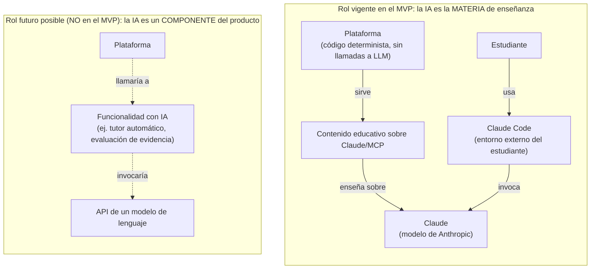

# AI_ARCHITECTURE.md — Rol de la IA en el Sistema

**Estado:** Aprobado

**Fecha:** 2026-07-19

Igual que `MCP.md` distingue "MCP como contenido" de "MCP como componente técnico", este documento distingue dos roles posibles de la IA en AI Engineering Academy, y fija cuál aplica al MVP.

## Los dos roles posibles de la IA en este proyecto

## Rol vigente en el MVP: la IA es la materia, no el motor

Esto es lo único que aplica a `EPIC-05` hoy, y es la razón por la que `ARCHITECTURE.md` no incluye ningún contenedor de "servicio de IA" en su vista de contenedores:

- El *runtime* de la plataforma (`BACKEND.md`, `FRONTEND.md`) es código determinista: Next.js, PostgreSQL, autenticación OAuth. **Ninguna ruta de la API (`API.md`) realiza una llamada a un modelo de lenguaje.**
- Claude, como modelo, y Claude Code, como herramienta, son objetos de aprendizaje: el estudiante los usa **fuera de la plataforma**, en su propio entorno, para construir los proyectos prácticos que el roadmap educativo especifica.
- La plataforma es responsable de **describir y organizar** ese aprendizaje (catálogo de niveles/proyectos, contenido trazable a documentación oficial — `MCP.md`), no de **ejecutarlo**.

Esta separación es intencional y se apoya directamente en:

- `PRODUCT.md` §4.2, que deja fuera de alcance del MVP cualquier funcionalidad no evaluada explícitamente.
- `ADR-0001`, cuya vista de contenedores no incluye ningún servicio de inferencia de modelos.
- El principio de simplicidad de `CLAUDE.md`: introducir una dependencia hacia una API de modelo de lenguaje en el runtime del producto sin una historia de usuario que lo justifique violaría la regla de "no incorporar dependencias sin justificar su necesidad".

## Rol futuro posible (explícitamente fuera de alcance, no decidido)

Es razonable imaginar funcionalidades futuras donde la plataforma sí llame a un modelo de lenguaje como parte de su propio producto — por ejemplo:

- Retroalimentación automática sobre la evidencia entregada por un estudiante (extensión de FEAT-04.2).
- Un asistente conversacional que oriente al estudiante sobre qué proyecto elegir a continuación.

**Ninguna de estas funcionalidades está evaluada, aprobada ni diseñada.** Se listan únicamente para trazar la frontera. Si en el futuro se propone alguna:

- Requiere su propia historia de usuario en `USER_STORIES.md` y su entrada en `BACKLOG.md`.
- Requiere un nuevo ADR que decida: qué proveedor/modelo se usa, cómo se gestionan costos y límites de uso, qué datos del estudiante se envían a un servicio externo (con las implicaciones de privacidad correspondientes, a evaluar en `SECURITY.md`).
- Ampliaría la vista de contenedores de `ARCHITECTURE.md`, que hoy no incluye ese componente.

## Por qué esta distinción importa para el proyecto

`PERSONAS.md` y `PRODUCT.md` son explícitos: el problema que resuelve la Academia es la brecha entre "saber usar un modelo" y "saber construir un sistema de ingeniería alrededor de él". Si la propia plataforma dependiera de llamadas a un LLM para funcionar, el proyecto se convertiría en un caso más del problema que dice resolver: una demo que usa IA en vez de una plataforma de ingeniería que *enseña* a usarla con rigor. Mantener el runtime del MVP libre de dependencias de modelos de lenguaje es, en sí mismo, una decisión de producto coherente con la misión de `VISION.md`.

## Explícitamente fuera de alcance de este documento

- Cualquier arquitectura de inferencia, prompt engineering interno o gestión de contexto de modelo — no aplica porque no hay llamadas a modelos desde el runtime del MVP.
- Costos, límites de uso o cuotas de API de modelos — no aplica por el mismo motivo.

## Trazabilidad

- Documento relacionado (misma distinción aplicada a MCP): `MCP.md`.
- Vista general y límites del MVP: `ARCHITECTURE.md`.
- Producto: `PRODUCT.md` §1 (Problema), §4.2 (fuera de alcance).
- Visión: `VISION.md`.
