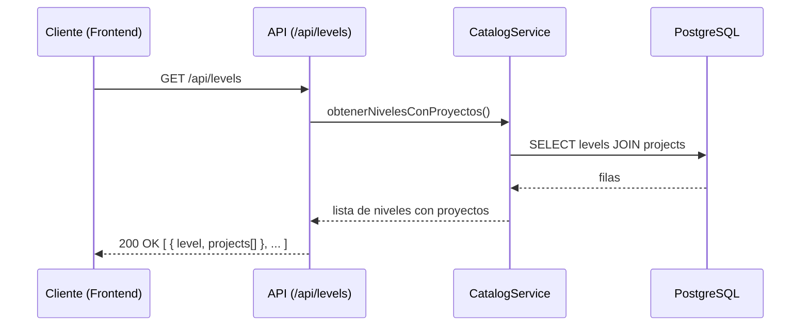

# API.md — Diseño de la API

**Estado:** Aprobado

**Fecha:** 2026-07-19

Especifica el contrato de la API interna que consume el propio frontend de la plataforma (`FRONTEND.md`). No es una API pública de terceros en el MVP. Describe recursos, convenciones y formato — no incluye implementación.

## Convenciones generales

- Estilo REST sobre HTTP, expuesto como Route Handlers de Next.js (`BACKEND.md`).
- Formato de intercambio: JSON.
- Autenticación: sesión establecida por la librería de autenticación (`TECH_STACK.md`, `SECURITY.md`); toda ruta bajo `/api/` salvo las de autenticación misma requiere sesión válida.
- Convención de nombres: recursos en plural, en inglés, kebab/snake según lo que use el framework por defecto (detalle de implementación, no de este documento).
- Versionado: no se introduce versionado de API (`/api/v1/...`) en el MVP — al ser una API interna consumida por un único cliente que se despliega junto con ella, no hay necesidad identificada; se reevaluaría si en el futuro se expone a terceros.

## Inventario de endpoints (MVP)

| Método | Ruta | Descripción | Servicio (`BACKEND.md`) | Historia relacionada |
|---|---|---|---|---|
| `GET` | `/api/levels` | Listar niveles con sus proyectos | `CatalogService` | US-01 |
| `GET` | `/api/levels/{levelSlug}` | Detalle de un nivel | `CatalogService` | US-01 |
| `GET` | `/api/projects/{projectSlug}` | Detalle de un proyecto (objetivo, prerrequisitos, resultado esperado) | `CatalogService` | US-02 |
| `POST` | `/api/enrollments` | Inscribirse en un proyecto | `EnrollmentService` | US-07 |
| `GET` | `/api/enrollments` | Listar las inscripciones del estudiante autenticado (progreso) | `EnrollmentService` | US-07 |
| `PATCH` | `/api/enrollments/{id}` | Actualizar el estado de una inscripción propia (ej. marcar `in_progress` → `completed`) | `EnrollmentService` | US-07 |
| `POST` | `/api/enrollments/{id}/evidence` | Registrar evidencia de un proyecto completado | `EvidenceService` | US-06 |
| `GET` | `/api/enrollments/{id}/evidence` | Consultar la evidencia registrada | `EvidenceService` | US-06 |
| `GET` / `POST` | `/api/auth/*` | Rutas de autenticación (login/logout/callback OAuth), generadas por la librería de autenticación | `AuthService` | US-08 |

## Formato de petición / respuesta (ejemplos ilustrativos)

### `POST /api/enrollments`

Petición:

```json
{
  "projectId": "6f6a6e9e-2b0a-4b6e-9a3a-2f0e6f2a9c11"
}
```

Respuesta `201 Created`:

```json
{
  "id": "b1e6a2b0-...",
  "studentId": "3c2e...",
  "projectId": "6f6a6e9e-...",
  "status": "not_started",
  "startedAt": null,
  "completedAt": null
}
```

### `PATCH /api/enrollments/{id}`

Petición:

```json
{
  "status": "completed"
}
```

Respuesta `200 OK`: representación actualizada del `Enrollment` (mismo formato que arriba).

Respuesta `409 Conflict` (transición inválida, ver `DATABASE.md`):

```json
{
  "error": "invalid_transition",
  "message": "No se puede pasar de 'completed' a 'in_progress'."
}
```

## Diagrama de secuencia: consulta de catálogo (lectura no autenticada opcionalmente pública)



## Manejo de errores

Sigue la convención definida en `BACKEND.md` §"Manejo de errores". Todo error de la API responde con un cuerpo consistente:

```json
{
  "error": "<código_de_error_estable>",
  "message": "<descripción legible>"
}
```

El campo `error` es estable y apto para lógica del cliente; `message` es para mostrar o depurar, no para tomar decisiones de flujo.

## Explícitamente fuera de alcance de este documento

- Documentación interactiva tipo OpenAPI/Swagger — se evaluará como Task de FEAT-05.1 cuando exista implementación real que documentar; prematuro definir el formato ahora.
- Endpoints de administración de contenido (crear/editar niveles y proyectos) — el catálogo se gestiona fuera de la UI en el MVP (`ARCHITECTURE.md`).
- Paginación, filtros avanzados de búsqueda — el volumen de niveles/proyectos esperado en el MVP no lo requiere; se añadiría cuando haya evidencia de necesidad.

## Trazabilidad

- Backend: `BACKEND.md`.
- Modelo de datos: `DATABASE.md`.
- Historias de usuario: US-01, US-02, US-06, US-07, US-08 (`USER_STORIES.md`, `BACKLOG.md`).
