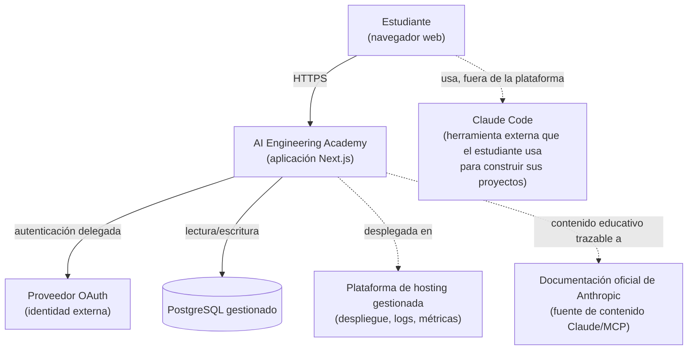
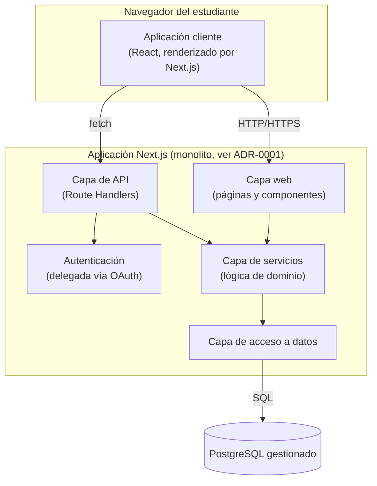

# ARCHITECTURE.md — Arquitectura del Sistema

**Estado:** Aprobado

**Fecha:** 2026-07-19

Este documento es el punto de entrada a la arquitectura técnica de AI Engineering Academy. Detalla la vista de sistema completa; cada capa se profundiza en su propio documento. Ninguna decisión aquí contradice `docs/adr/0001-arquitectura-inicial-de-la-plataforma.md` (**Aceptado**) — este conjunto de documentos es la continuación de esa decisión hacia el nivel de diseño técnico detallado que `BACKLOG.md` (TASK-05.1.1) exige antes de habilitar cualquier implementación de código.

## Mapa de documentos de arquitectura

| Documento | Contenido |
|---|---|
| **ARCHITECTURE.md** (este) | Vista de sistema, principios, límites del MVP |
| [TECH_STACK.md](./TECH_STACK.md) | Tecnologías concretas elegidas, con justificación |
| [DATABASE.md](./DATABASE.md) | Modelo de datos detallado (ERD) |
| [API.md](./API.md) | Diseño de la API interna |
| [BACKEND.md](./BACKEND.md) | Arquitectura de capas del backend |
| [FRONTEND.md](./FRONTEND.md) | Arquitectura de la aplicación cliente |
| [SECURITY.md](./SECURITY.md) | Modelo de amenazas y controles de seguridad |
| [MCP.md](./MCP.md) | Relación de la plataforma con el Model Context Protocol |
| [AI_ARCHITECTURE.md](./AI_ARCHITECTURE.md) | Rol de la IA en el producto vs. en el contenido educativo |

## Principios arquitectónicos

Heredados de `CLAUDE.md` y `ADR-0001`, aplicados de forma consistente en todos los documentos de este conjunto:

1. **Monolito simple antes que microservicios.** Un solo despliegue, una sola base de código, hasta que exista evidencia concreta de que no alcanza.
2. **Servicios gestionados antes que infraestructura propia.** Se delega hosting, base de datos y autenticación a proveedores gestionados para minimizar carga operativa de un equipo pequeño.
3. **Seguridad por defecto, no como capa añadida.** Autenticación delegada, validación en el borde del sistema, principio de menor privilegio.
4. **Observabilidad desde el primer despliegue.** Logs y métricas mínimas definidas antes de escribir la primera línea de código de producto.
5. **Cada dependencia externa se justifica explícitamente** (regla de `CLAUDE.md`) — ver `TECH_STACK.md`.
6. **El límite del MVP es real, no aspiracional.** Todo lo que no sea necesario para `EPIC-05` (`BACKLOG.md`) se marca explícitamente como fuera de alcance, con su fase futura correspondiente.

## Vista de contexto del sistema

**Lectura del diagrama:** la plataforma es el único sistema que este equipo construye y opera. Claude Code es una herramienta externa que el estudiante ejecuta en su propio entorno — la plataforma no la embebe ni la orquesta en el MVP (ver `AI_ARCHITECTURE.md` y `MCP.md` para el detalle de este límite).

## Vista de contenedores (dentro del sistema)

**Lectura del diagrama:** el detalle de cada contenedor se desarrolla en `FRONTEND.md` (capa web/cliente), `BACKEND.md` (API, servicios, acceso a datos) y `SECURITY.md` (capa de autenticación).

## Límites explícitos del MVP

Consistente con `PRODUCT.md` §4.2 y `EPIC-05` de `BACKLOG.md`:

**Dentro de alcance (MVP):**

- Catálogo de niveles y proyectos (lectura).
- Registro/autenticación de estudiante.
- Seguimiento de progreso por proyecto.
- Registro de evidencia exportable al completar un proyecto.
- Observabilidad y seguridad básicas del despliegue.

**Explícitamente fuera de alcance del MVP (requeriría su propio ADR si se propone):**

- Cualquier llamada a un modelo de lenguaje desde el runtime de la plataforma (ver `AI_ARCHITECTURE.md`).
- Un servidor MCP propio expuesto por la plataforma (ver `MCP.md`).
- Roles múltiples/administración de contenido vía UI (el contenido del catálogo se gestiona fuera de la UI en el MVP — ver `DATABASE.md`).
- Notificaciones, mensajería en tiempo real, o funcionalidad multi-tenant.
- Escalado horizontal, colas de trabajo o arquitectura de microservicios.

## Trazabilidad

- Decisión de base: `docs/adr/0001-arquitectura-inicial-de-la-plataforma.md`.
- Backlog: `BACKLOG.md`, EPIC-05 (Plataforma base / MVP técnico), TASK-05.1.1 (diseño técnico detallado del MVP, que este conjunto de documentos desarrolla).
- Producto: `PRODUCT.md` §4 (alcance funcional).
