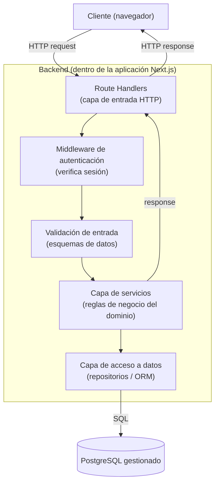
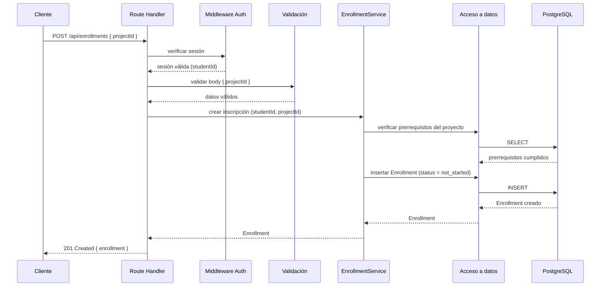

# BACKEND.md — Arquitectura de Backend

**Estado:** Aprobado

**Fecha:** 2026-07-19

Detalla la organización interna del backend dentro del monolito Next.js decidido en `docs/adr/0001-arquitectura-inicial-de-la-plataforma.md`. No incluye código — describe capas, responsabilidades y el flujo de una petición.

## Arquitectura en capas

## Responsabilidad de cada capa

| Capa | Responsabilidad | No hace |
|---|---|---|
| **Route Handlers** | Recibir la petición HTTP, delegar a middleware/validación/servicios, traducir el resultado a una respuesta HTTP con el código de estado correcto | No contiene reglas de negocio ni acceso directo a la base de datos |
| **Middleware de autenticación** | Verificar que existe una sesión válida (ver `SECURITY.md`) antes de permitir el acceso a rutas protegidas | No decide autorización fina (por ejemplo, "este estudiante puede ver esta evidencia") — eso vive en la capa de servicios |
| **Validación de entrada** | Verificar que el cuerpo/parámetros de la petición cumplen el esquema esperado antes de tocar lógica de negocio (ver justificación de la librería de validación en `TECH_STACK.md`) | No transforma datos de dominio, solo valida forma y tipos |
| **Capa de servicios** | Implementar las reglas de negocio del dominio: transiciones de estado de `Enrollment` (`DATABASE.md`), reglas de autorización fina, orquestación entre repositorios | No conoce detalles de HTTP ni de SQL directamente |
| **Capa de acceso a datos** | Traducir operaciones de dominio a consultas sobre las entidades de `DATABASE.md`, a través del ORM decidido en `TECH_STACK.md` | No contiene reglas de negocio |

Esta separación existe para que las reglas de negocio (por ejemplo, "un `Evidence` solo puede crearse si el `Enrollment` está `completed`", `DATABASE.md`) sean verificables con pruebas automatizadas sin necesidad de levantar un servidor HTTP — requisito práctico para cumplir la regla de `CLAUDE.md` de pruebas automatizadas en toda funcionalidad nueva.

## Servicios de dominio previstos para el MVP

Mapeados directamente a los Features de `EPIC-05` en `BACKLOG.md`:

| Servicio | Responsabilidad | Feature relacionada |
|---|---|---|
| `CatalogService` | Listar niveles y proyectos, resolver prerrequisitos | FEAT-05.2 |
| `EnrollmentService` | Crear inscripciones, gestionar transiciones de estado (`DATABASE.md`) | FEAT-05.2, FEAT-04.1 |
| `EvidenceService` | Registrar evidencia al completar un proyecto, validar que el `Enrollment` esté `completed` | FEAT-04.2 |
| `AuthService` | Envoltorio sobre la librería de autenticación (`TECH_STACK.md`) para exponer la identidad del estudiante autenticado a los demás servicios | FEAT-05.1 |

## Flujo de una petición autenticada (ejemplo: inscribirse en un proyecto)

## Manejo de errores (convención)

- Errores de validación de entrada → `400 Bad Request`, cuerpo con detalle de campo(s) inválido(s).
- Falta de sesión válida → `401 Unauthorized`.
- Sesión válida pero acción no permitida (por ejemplo, crear evidencia de un `Enrollment` ajeno) → `403 Forbidden`.
- Recurso inexistente (proyecto, nivel) → `404 Not Found`.
- Violación de regla de negocio (por ejemplo, evidencia sobre un `Enrollment` no completado) → `409 Conflict`.
- Error no anticipado → `500 Internal Server Error`, registrado en observabilidad (ver `SECURITY.md`), nunca con detalle interno expuesto al cliente.

El detalle completo de endpoints, formatos de petición/respuesta y códigos se especifica en `API.md`.

## Explícitamente fuera de alcance de este documento

- Colas de trabajo, procesamiento asíncrono o background jobs — no hay necesidad identificada en el MVP.
- Caché de aplicación (Redis u otro) — no justificado para el volumen esperado del MVP; se evaluaría con evidencia real de necesidad.
- Rate limiting a nivel de aplicación — se apoya en las protecciones de la plataforma de hosting gestionada (`TECH_STACK.md`) mientras no exista evidencia de necesidad de un control más fino.

## Trazabilidad

- Vista general: `ARCHITECTURE.md`.
- Modelo de datos: `DATABASE.md`.
- Stack: `TECH_STACK.md`.
- Backlog: `BACKLOG.md`, EPIC-05 (FEAT-05.1, FEAT-05.2).
