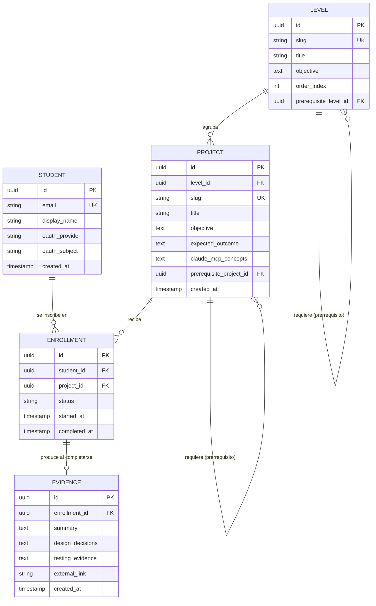
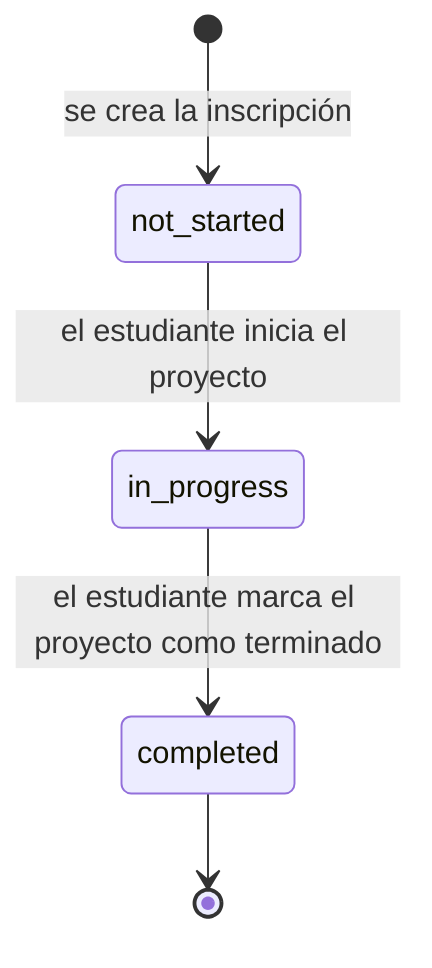

# DATABASE.md — Modelo de Datos

**Estado:** Aprobado

**Fecha:** 2026-07-19

Este documento detalla el esquema conceptual de base de datos, partiendo de las cinco entidades de alto nivel ya definidas en `docs/adr/0001-arquitectura-inicial-de-la-plataforma.md` §"Modelo de datos educativo": Estudiante, Nivel, Proyecto, Inscripción/Progreso, Evidencia.

Es un **modelo conceptual** (entidades, atributos, relaciones, restricciones) — no incluye SQL de migración ni sintaxis de un ORM específico, conforme a la instrucción de no escribir código en este sprint.

## Diagrama entidad-relación

## Descripción de entidades

### Student (Estudiante)

Usuario autenticado de la plataforma. Se crea a partir de la primera autenticación exitosa vía OAuth (`SECURITY.md`); no existe un flujo de registro con contraseña propia, conforme a `ADR-0001`.

| Campo | Tipo conceptual | Notas |
|---|---|---|
| `id` | identificador único | clave primaria |
| `email` | texto, único | provisto por el proveedor OAuth |
| `display_name` | texto | provisto por el proveedor OAuth |
| `oauth_provider` / `oauth_subject` | texto | identifican la cuenta externa; no se almacenan contraseñas |
| `created_at` | fecha/hora | auditoría |

### Level (Nivel)

Agrupación de proyectos por etapa del roadmap educativo (`ROADMAP.md`, Fase 1; `EPIC-01` de `BACKLOG.md`).

| Campo | Tipo conceptual | Notas |
|---|---|---|
| `id` | identificador único | clave primaria |
| `slug` | texto, único | identificador legible en URLs |
| `title` / `objective` | texto | contenido mostrado al estudiante (US-01) |
| `order_index` | entero | orden de presentación |
| `prerequisite_level_id` | referencia a `Level` (opcional) | modela "prerrequisito de cada nivel respecto al anterior" (US-01) |

### Project (Proyecto)

Unidad de aprendizaje práctica (US-02).

| Campo | Tipo conceptual | Notas |
|---|---|---|
| `id` | identificador único | clave primaria |
| `level_id` | referencia a `Level` | pertenencia al nivel |
| `slug` | texto, único | identificador legible en URLs |
| `title` / `objective` / `expected_outcome` | texto | campos obligatorios de la plantilla de especificación (TASK-01.2.1) |
| `claude_mcp_concepts` | texto | qué conceptos de Claude Code/MCP se practican (criterio de aceptación de US-02) |
| `prerequisite_project_id` | referencia a `Project` (opcional) | prerrequisito entre proyectos dentro o entre niveles |
| `created_at` | fecha/hora | auditoría |

### Enrollment (Inscripción / Progreso)

Relación entre `Student` y `Project`, con estado (US-07).

| Campo | Tipo conceptual | Notas |
|---|---|---|
| `id` | identificador único | clave primaria |
| `student_id` / `project_id` | referencias | par único: un estudiante tiene como máximo una inscripción activa por proyecto |
| `status` | enumeración: `not_started` \| `in_progress` \| `completed` | modelo de estados a formalizar en TASK-04.1.1; ver diagrama de transición abajo |
| `started_at` / `completed_at` | fecha/hora (opcionales) | auditoría de progreso |

### Evidence (Evidencia)

Artefacto entregado por el estudiante al completar un proyecto (US-06), en relación uno a uno opcional con `Enrollment`.

| Campo | Tipo conceptual | Notas |
|---|---|---|
| `id` | identificador único | clave primaria |
| `enrollment_id` | referencia a `Enrollment`, única | solo existe cuando la inscripción llega a `completed` |
| `summary` / `design_decisions` / `testing_evidence` | texto | estructura mínima definida en TASK-04.2.1 (criterio de aceptación de US-06) |
| `external_link` | texto (opcional) | mecanismo de exportación fuera de la plataforma |
| `created_at` | fecha/hora | auditoría |

## Diagrama de estados de Enrollment

Este diagrama formaliza, a nivel de modelo de datos, el criterio de aceptación de US-07 ("no iniciado / en progreso / completado"). No se permiten transiciones hacia atrás en el MVP (por ejemplo, de `completed` a `in_progress`) — si se necesitara reabrir un proyecto completado, es una decisión de producto pendiente, no resuelta en este documento.

## Reglas de integridad relevantes

- Un `Project` siempre pertenece a exactamente un `Level`.
- Un `Enrollment` liga exactamente un `Student` con exactamente un `Project`; no se permiten inscripciones duplicadas activas para el mismo par.
- Un `Evidence` solo puede existir si su `Enrollment` asociado está en estado `completed` (regla de negocio a validar en la capa de servicios, ver `BACKEND.md`, no solo en la base de datos).
- Los prerrequisitos (`prerequisite_level_id`, `prerequisite_project_id`) son opcionales y no forman ciclos — la validación de ausencia de ciclos es una regla de negocio, no una restricción nativa de la base de datos relacional.

## Explícitamente fuera de alcance de este documento

- Tablas de soporte técnico de la librería de autenticación (sesiones, tokens) — se generan y gestionan por la librería elegida en `TECH_STACK.md`, no se diseñan a mano aquí.
- Roles de administración de contenido (crear/editar `Level`/`Project` vía UI) — el catálogo se gestiona fuera de la UI en el MVP, conforme a `ARCHITECTURE.md`.
- Particionamiento, índices de rendimiento específicos, estrategia de backups — se definen en la Task de despliegue (fuera del alcance de un documento de arquitectura).

## Trazabilidad

- Modelo de alto nivel: `docs/adr/0001-arquitectura-inicial-de-la-plataforma.md`.
- Historias de usuario: US-01, US-02, US-06, US-07 (`USER_STORIES.md`).
- Backlog: `BACKLOG.md`, TASK-05.1.1, TASK-04.1.1, TASK-04.2.1.
