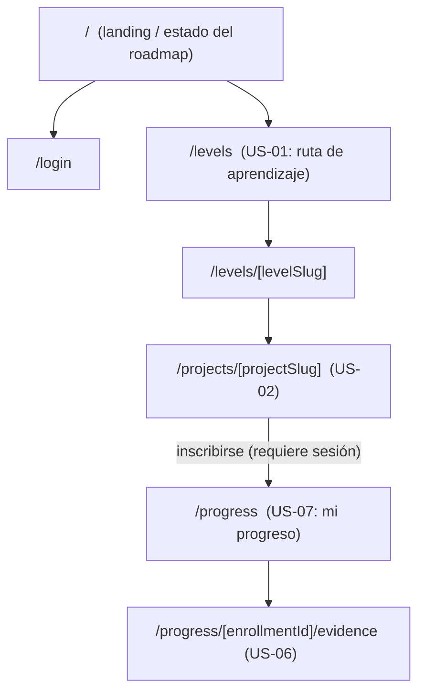
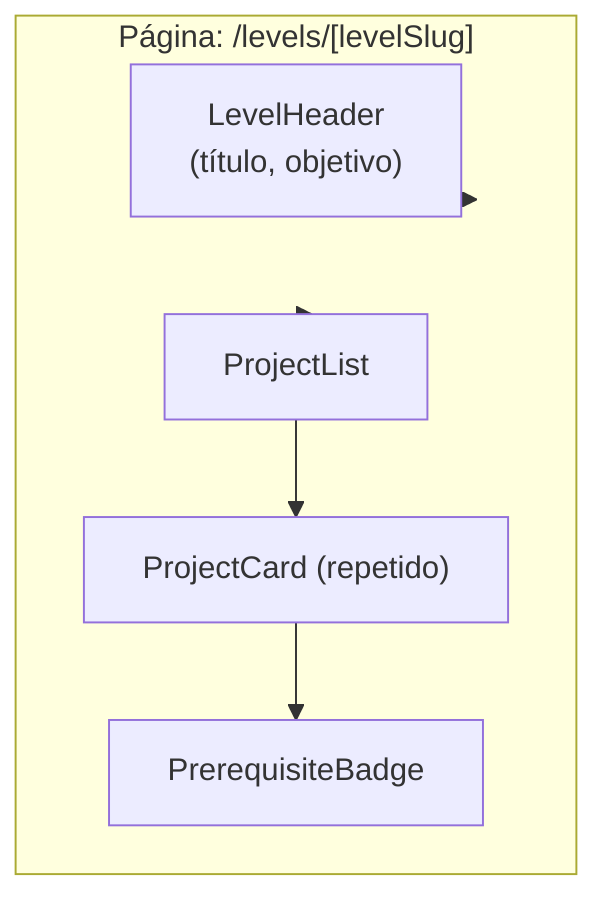
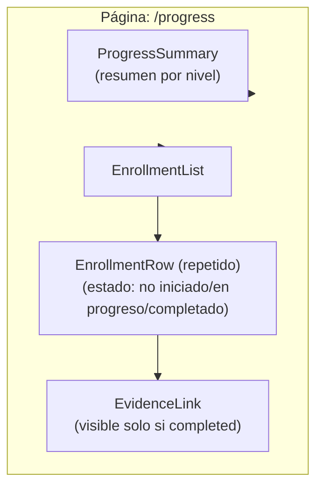
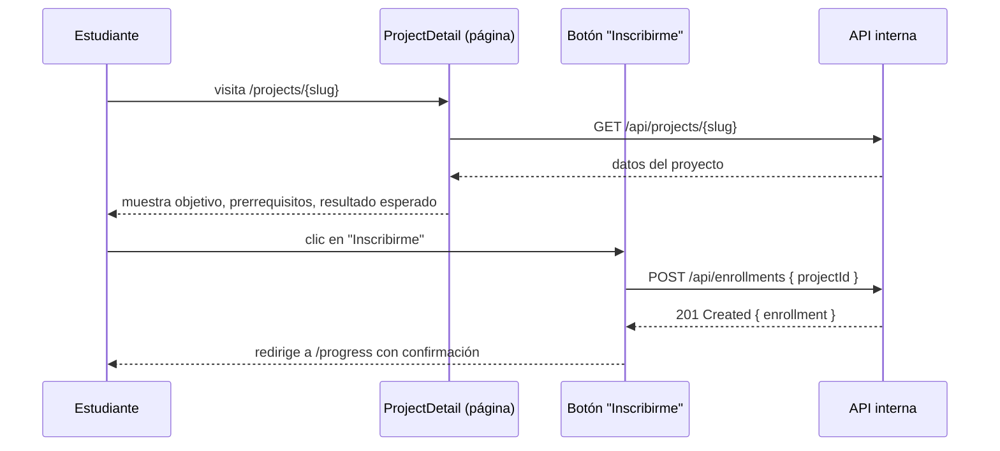

# FRONTEND.md — Arquitectura de Frontend

**Estado:** Aprobado

**Fecha:** 2026-07-19

Describe la organización de la aplicación cliente dentro del monolito Next.js (`ADR-0001`). No incluye código ni diseño visual — describe estructura de rutas, composición de componentes, manejo de estado y accesibilidad.

## Mapa de rutas (MVP)

Derivado directamente de los endpoints de `API.md` y de las historias US-01, US-02, US-06, US-07, US-08.

Todas las rutas bajo `/progress` requieren sesión autenticada (US-08); `/levels` y `/projects/*` son de lectura pública, coherente con el objetivo de que un visitante pueda evaluar la Academia antes de crear cuenta.

## Composición de componentes (por página)

## Manejo de estado

| Tipo de estado | Mecanismo | Ejemplo |
|---|---|---|
| Estado de sesión (¿hay estudiante autenticado?) | Provisto por la librería de autenticación (`TECH_STACK.md`), disponible como contexto global de la aplicación | Mostrar "Iniciar sesión" vs. "Mi progreso" en la navegación |
| Datos del servidor (catálogo, progreso) | Renderizado en servidor (Server Components de Next.js) para la carga inicial; sin una librería de gestión de estado global adicional en el MVP | Página `/levels` obtiene la lista de niveles en el servidor antes de renderizar |
| Interacción del usuario (formularios, botones de acción) | Estado local de componente | Botón "Inscribirme" mostrando estado de carga mientras espera la respuesta de `POST /api/enrollments` |

**Decisión de simplicidad:** no se introduce una librería de gestión de estado global (Redux, Zustand, etc.) en el MVP. El estado del servidor se resuelve mayoritariamente en el servidor (patrón nativo de Next.js), y el estado de UI local no cruza suficientes componentes como para justificar esa dependencia adicional — coherente con la regla de `CLAUDE.md` de no incorporar dependencias sin necesidad justificada.

## Flujo de interacción: inscribirse en un proyecto

## Accesibilidad

Principio heredado de `CLAUDE.md` ("priorizar accesibilidad desde el inicio"), aplicado como requisitos concretos del MVP:

- Navegación completa por teclado en todas las páginas listadas arriba.
- Contraste de color conforme a WCAG AA como mínimo.
- Estados de carga y error anunciados a lectores de pantalla (no solo indicados visualmente).
- Formularios (inscripción, marcar progreso) con etiquetas asociadas explícitamente a sus campos.

El detalle de implementación (qué componentes de UI concretos se usan) se resuelve en la Task de implementación correspondiente, no en este documento.

## Explícitamente fuera de alcance de este documento

- Sistema de diseño visual completo (paleta, tipografía, tokens) — es una decisión de diseño de producto, no de arquitectura; se abordará como su propia Task cuando se inicie la implementación de FEAT-05.2.
- Internacionalización (i18n) — el producto es en español por ahora (`PERSONAS.md`); no hay necesidad identificada de multi-idioma en el MVP.
- Aplicación móvil nativa — fuera de alcance; el frontend web debe ser responsive, no nativo.

## Trazabilidad

- API consumida: `API.md`.
- Vista general: `ARCHITECTURE.md`.
- Historias de usuario: US-01, US-02, US-06, US-07, US-08.
