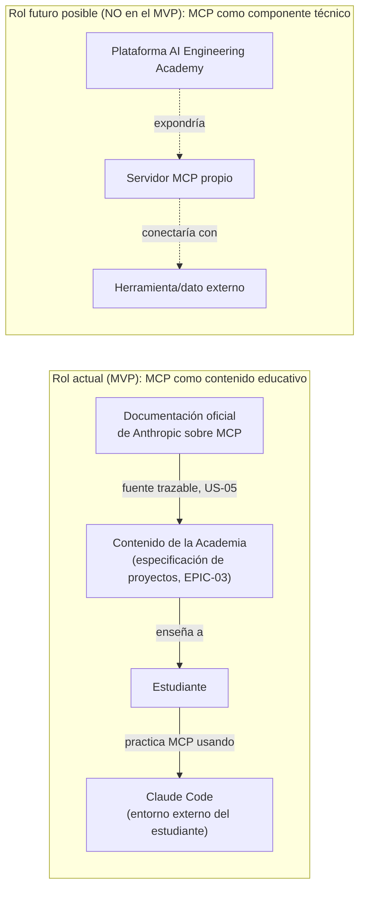

# MCP.md — Relación de la Plataforma con el Model Context Protocol

**Estado:** Aprobado

**Fecha:** 2026-07-19

Este documento existe para eliminar una ambigüedad importante: **MCP (Model Context Protocol) es objeto de enseñanza de AI Engineering Academy, no un componente técnico que la plataforma del MVP implemente o exponga.** Confundir ambos roles llevaría a decisiones de arquitectura innecesarias. Este documento fija el límite explícitamente.

## Los dos roles posibles de MCP en este proyecto

## Rol vigente en el MVP: MCP como contenido educativo

Esto es lo único que aplica a `EPIC-05` (Plataforma base) hoy:

- La plataforma **almacena y presenta** contenido *sobre* MCP (dentro de `Project.claude_mcp_concepts`, `DATABASE.md`) — texto y referencias, no una implementación funcional del protocolo.
- Ese contenido debe ser trazable a la documentación oficial de Anthropic, conforme a `CLAUDE.md` y a la Story US-05 (`USER_STORIES.md`, `EPIC-03` de `BACKLOG.md`).
- El estudiante practica MCP **fuera de la plataforma**, usando Claude Code en su propio entorno de desarrollo (ver `ARCHITECTURE.md`, vista de contexto) como parte de los proyectos prácticos que el roadmap educativo especifica (`EPIC-01`).
- La plataforma **no ejecuta, no orquesta y no expone** ningún servidor o cliente MCP en tiempo de ejecución.

Esto es consistente con `PRODUCT.md` §4.2, que deja fuera de alcance del MVP cualquier funcionalidad no evaluada, y con `ARCHITECTURE.md`, que excluye explícitamente "un servidor MCP propio expuesto por la plataforma" de los límites del MVP.

## Rol futuro posible (explícitamente fuera de alcance, no decidido)

Es razonable imaginar, en fases posteriores (`ROADMAP.md`, Fase 3 — Expansión), que la propia plataforma exponga un servidor MCP — por ejemplo, para que un estudiante conecte su Claude Code directamente al catálogo de proyectos o a su progreso. **Esta posibilidad no está evaluada, aprobada ni diseñada.** Se menciona aquí únicamente para trazar la frontera con claridad y evitar que se implemente por accidente o suposición.

Si en el futuro se propone, requerirá:

- Su propia historia de usuario en `USER_STORIES.md`.
- Un nuevo ADR que justifique la necesidad (regla de `CLAUDE.md` de no incorporar dependencias/servicios sin justificación).
- Una actualización de este mismo documento, que pasaría de describir un límite a describir una implementación real.

## Proceso de trazabilidad de contenido MCP (vigente)

Continuación de la Task TASK-03.1.1 (`BACKLOG.md`, FEAT-03.1):

- Todo contenido educativo sobre MCP incluye una referencia explícita a la sección correspondiente de la documentación oficial de Anthropic en la que se basa.
- La cadencia de revisión de vigencia de ese contenido (para detectar cambios en la documentación oficial) es una decisión pendiente de TASK-03.1.1, no de este documento de arquitectura.

## Explícitamente fuera de alcance de este documento

- Cualquier especificación técnica de un servidor MCP (herramientas expuestas, esquema de recursos) — no existe tal servidor en el MVP.
- Integración de la plataforma con Claude Code como cliente MCP — no existe tal integración en el MVP.

## Trazabilidad

- Vista general y límites del MVP: `ARCHITECTURE.md`.
- Rol de la IA en el producto (relacionado, ver distinción similar): `AI_ARCHITECTURE.md`.
- Backlog: `BACKLOG.md`, EPIC-03 (FEAT-03.1, US-05).
- Glosario: `GLOSSARY.md`, entrada "MCP (Model Context Protocol)".
