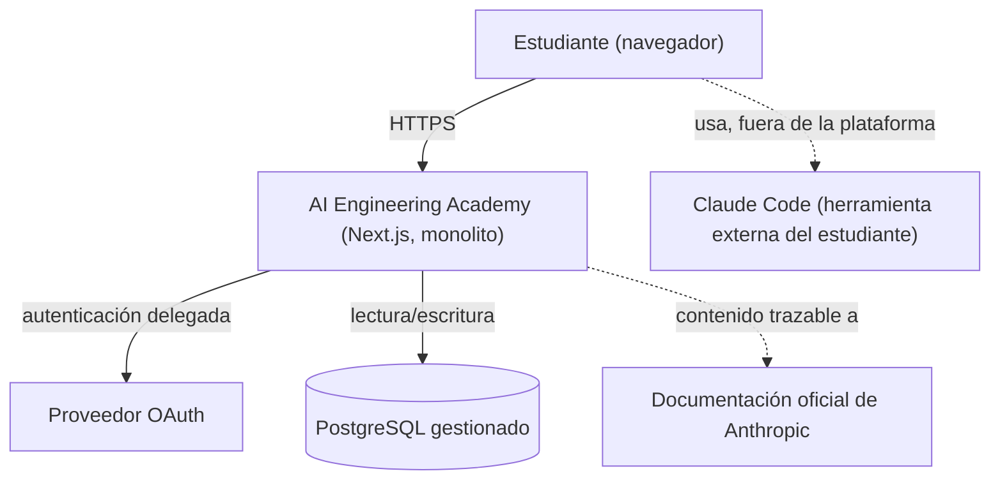

# PROJECT BIBLE — AI Engineering Academy

**Versión:** 1.0
**Estado:** Aprobado
**Fecha:** 2026-07-19
**Naturaleza del documento:** Single Source of Truth (SSOT) del proyecto.

> Este documento consolida y resume la estrategia, el producto y la arquitectura de AI Engineering Academy, ya definidos y aprobados en los documentos individuales del repositorio. No los reemplaza como fuente de detalle operativo (siguen siendo la referencia para su propia área), pero cualquier persona o agente de IA debería poder entender el proyecto completo leyendo únicamente este documento. Cuando exista una diferencia entre este documento y un documento fuente, prevalece el documento fuente más reciente y se corrige este documento como parte del mismo cambio.

---

## 1. Resumen Ejecutivo

AI Engineering Academy es una plataforma de formación práctica para convertir desarrolladores, científicos de datos y bootcampers en AI Engineers Senior, mediante proyectos reales construidos con Claude Code y el Model Context Protocol (MCP), siguiendo el mismo rigor de ingeniería de software que se exige en un equipo profesional: historia de usuario, diseño aprobado, implementación con pruebas, documentación y trazabilidad.

El proyecto se encuentra en **Fase 0 — Fundación, completada**: existe visión, producto, personas, historias de usuario, backlog jerárquico, flujo Git/CI, un ADR de arquitectura aceptado y un diseño técnico detallado del sistema (9 documentos de arquitectura aprobados). **Aún no existe código de aplicación.** El siguiente hito es la Fase 1 (diseño del roadmap educativo), seguida de la Fase 2 (implementación del MVP técnico).

## 2. Visión General del Producto

AI Engineering Academy no es un curso de video ni una colección de prompts. Es un camino de aprendizaje donde cada nivel se ancla en un proyecto funcional que el estudiante construye, documenta y prueba, replicando el ciclo de ingeniería de un equipo real. Claude Code y MCP son herramientas de trabajo del estudiante, no el tema pasivo de una clase — el estudiante los usa fuera de la plataforma para construir sus proyectos (ver capítulo 15, límite arquitectónico explícito).

## 3. Misión

> Formar AI Engineers Senior capaces de diseñar, construir y operar sistemas de IA en producción, mediante un roadmap práctico basado en proyectos reales, usando Claude Code, el Model Context Protocol (MCP) y las mejores prácticas de ingeniería de software.

## 4. Visión

> Ser la referencia hispanohablante en formación práctica de ingeniería de IA: un lugar donde "aprender" significa "construir y desplegar", no acumular certificados teóricos.

## 5. Objetivos Estratégicos

1. Ofrecer una ruta de aprendizaje estructurada por niveles, anclada en proyectos verificables, no en ejercicios aislados.
2. Enseñar el ciclo de ingeniería completo: historia de usuario → diseño → implementación incremental → pruebas → documentación.
3. Mantener el contenido sobre Claude y MCP alineado con la documentación oficial de Anthropic en todo momento.
4. Permitir que el estudiante demuestre progreso con evidencia tangible (proyectos funcionales, no solo insignias).

## 6. Problemas que Resuelve

Existe una brecha entre **saber usar un modelo de lenguaje** y **saber construir, probar, documentar y operar un sistema de IA en producción**. La mayoría de los recursos educativos disponibles se centran en prompting o en demos de un solo archivo, sin cubrir el oficio completo de ingeniería de software aplicado a proyectos de IA. AI Engineering Academy cierra esa brecha enseñando el oficio completo, no solo la herramienta.

## 7. Público Objetivo

- **Desarrolladores backend/fullstack** que quieren especializarse en IA generativa sin partir de cero en ingeniería de software.
- **Data Scientists / ML Engineers** que dominan modelos pero necesitan llevar sistemas a producción con buenas prácticas (testing, CI/CD, observabilidad).
- **Estudiantes avanzados y bootcampers** que buscan un camino estructurado y verificable hacia el rol de AI Engineer, con evidencia de portafolio.

## 8. Personas Principales

| Persona | Rol actual | Necesidad central |
|---|---|---|
| **Daniela** | Desarrolladora backend (Node.js/Python), 4 años de experiencia | Especializarse en IA sin abandonar sus buenas prácticas de ingeniería; quiere evidencia de portafolio, no solo certificados |
| **Marco** | Data Scientist / ML Engineer, poca experiencia en ingeniería de producción | Aprender a llevar sistemas basados en LLMs a producción con observabilidad y seguridad, con contenido de MCP trazable a fuentes oficiales |
| **Sofía** | Bootcamper recién egresada, en búsqueda de su primer rol como AI Engineer | Construir un portafolio de proyectos reales y demostrables; aprender el vocabulario y las prácticas de un equipo de ingeniería real |

Perfiles completos, frustraciones y citas representativas: `PERSONAS.md`.

## 9. Principios del Producto

- **Proyecto real por encima de ejercicio de juguete**: si no se puede construir y ejecutar, no es un módulo válido.
- **Rigor documental**: toda decisión de producto relevante se refleja en el backlog, el changelog y, si es arquitectónica, en un ADR.
- **Fidelidad a la fuente**: el contenido sobre Claude y MCP no se improvisa; se basa en documentación oficial de Anthropic.
- **Incremental por diseño**: se prioriza completar y validar una fase antes de expandir el alcance.

## 10. Principios de Ingeniería

1. No se escribe código sin que exista una historia de usuario y un diseño técnico aprobado.
2. Toda funcionalidad nueva o modificada requiere pruebas automatizadas.
3. Las decisiones arquitectónicas relevantes se registran mediante ADR.
4. No se incorporan dependencias o servicios externos sin justificar explícitamente su necesidad.
5. Se prioriza simplicidad, seguridad, accesibilidad y observabilidad desde el inicio, no como capas añadidas después.
6. Los cambios son pequeños e incrementales: un sprint se completa antes de iniciar el siguiente.
7. Código, documentación y backlog se mantienen sincronizados en todo momento — ningún cambio de código se considera terminado si la documentación queda desactualizada.

## 11. Principios de UX

Derivados de `FRONTEND.md` y del principio de accesibilidad de `CLAUDE.md`:

- Navegación completa por teclado en toda la aplicación.
- Contraste de color conforme a WCAG AA como mínimo.
- Estados de carga y error anunciados a lectores de pantalla, no solo indicados visualmente.
- Formularios con etiquetas asociadas explícitamente a sus campos.
- Simplicidad de interacción por encima de personalización: sin gestión de estado global compleja mientras no exista evidencia de necesidad.
- Interfaz en español (público objetivo actual); sin internacionalización en el MVP.

## 12. Alcance del MVP

**Dentro de alcance:**

- Catálogo de niveles y proyectos prácticos (lectura pública).
- Registro y autenticación de estudiante (vía OAuth delegado).
- Seguimiento de progreso del estudiante por proyecto (no iniciado / en progreso / completado).
- Registro de evidencia exportable al completar un proyecto (portafolio).
- Observabilidad y seguridad básicas desde el primer despliegue.

**Explícitamente fuera de alcance del MVP** (requeriría su propia historia de usuario y, si aplica, ADR):

- Certificaciones oficiales, mentoría en vivo, marketplace de terceros, monetización/pagos.
- Cualquier llamada a un modelo de lenguaje desde el runtime de la plataforma (capítulo 15).
- Un servidor MCP propio expuesto por la plataforma (capítulo 15).
- Roles múltiples o administración de contenido vía interfaz; el catálogo se gestiona fuera de la UI en el MVP.
- Notificaciones, mensajería en tiempo real, multi-tenancy, escalado horizontal o arquitectura de microservicios.

## 13. Funcionalidades Principales

Mapeadas a los Epics del backlog (capítulo 27):

| Funcionalidad | Epic | Historias clave |
|---|---|---|
| Ruta de aprendizaje por niveles | EPIC-01 | US-01, US-02 |
| Ciclo de ingeniería exigido por proyecto (historia, diseño, ADR) | EPIC-02 | US-03, US-04 |
| Contenido de Claude/MCP trazable a fuente oficial | EPIC-03 | US-05 |
| Seguimiento de progreso y evidencia de portafolio | EPIC-04 | US-06, US-07 |
| Plataforma base: autenticación, primer módulo, observabilidad | EPIC-05 | US-08, US-09, US-10 |

## 14. Roadmap Resumido

| Fase | Contenido | Estado |
|---|---|---|
| **Fase 0 — Fundación** | Documentación fundacional, diseño de producto, flujo Git/CI, ADR-0001, arquitectura detallada | **Completada** |
| **Fase 1 — Diseño del roadmap educativo** | Taxonomía de niveles, especificación de proyectos, plantillas de historia de usuario y ADR educativo, trazabilidad de contenido MCP (Sprints 1.1–1.4) | Próxima |
| **Fase 2 — MVP de plataforma** | Diseño técnico final (proveedor de hosting/BD), autenticación y persistencia, primer módulo educativo, observabilidad (Sprints 2.1–2.4) | Pendiente, bloqueada por Fase 1 |
| **Fase 3 — Expansión de contenido práctico** | Módulos avanzados de MCP/agentes, proyectos adicionales | No desglosada aún |
| **Fase 4 — Madurez y comunidad** | Contribución externa, escalabilidad justificada vía ADR | No desglosada aún |

Ninguna fase inicia hasta que la anterior esté completa. Detalle de sprints: `ROADMAP_DEVELOPMENT.md`.

## 15. Arquitectura de Alto Nivel

Monolito full-stack (Next.js/TypeScript) con base de datos relacional gestionada, autenticación delegada y hosting gestionado — decisión registrada en `ADR-0001` (Aceptado) y desarrollada en `ARCHITECTURE.md`.

**Dos límites arquitectónicos deliberados**, formalizados en `MCP.md` y `AI_ARCHITECTURE.md`:

- **MCP es materia de enseñanza, no un componente técnico del MVP.** La plataforma describe MCP; no expone un servidor MCP.
- **La IA es la materia enseñada, no el motor del producto.** El runtime del MVP no realiza ninguna llamada a un modelo de lenguaje.

Entidades de dominio (detalle completo en `DATABASE.md`): `Student`, `Level`, `Project`, `Enrollment` (progreso), `Evidence` (portafolio).

## 16. Tecnologías Aprobadas

| Capa | Tecnología | Estado |
|---|---|---|
| Framework de aplicación | Next.js (App Router) + TypeScript | Decidido (`ADR-0001`) |
| UI | React (parte de Next.js) | Decidido |
| Estilos | Sistema de utilidades CSS (ej. Tailwind) | Aprobado (`TECH_STACK.md`) |
| Base de datos | PostgreSQL gestionado | Decidido (`ADR-0001`); proveedor concreto pendiente |
| ORM | ORM tipado para TypeScript (ej. Prisma) | Aprobado |
| Autenticación | Librería de autenticación sobre OAuth (ej. Auth.js) | Decidido (`ADR-0001`) |
| Validación de entrada | Librería de validación de esquemas (ej. Zod) | Aprobado |
| Pruebas | Framework unitario/integración (ej. Vitest) + E2E (ej. Playwright) | Aprobado |
| CI | GitHub Actions | En uso |
| Hosting | Plataforma gestionada compatible con Next.js | Decidido (`ADR-0001`); proveedor concreto pendiente |

Toda dependencia nueva debe justificarse explícitamente (principio de ingeniería #4). Detalle y justificación completa: `TECH_STACK.md`.

## 17. Convenciones del Proyecto

- Idioma de la documentación y del producto: español.
- Nomenclatura de identificadores de backlog: `EPIC-XX`, `FEAT-XX.Y`, `US-XX`, `TASK-XX.Y.Z` (ver capítulo 27).
- Todo documento de arquitectura o ADR declara su **Estado** (`Propuesto` / `Aprobado` / `Aceptado`) y **Fecha** en su encabezado.
- Todo documento nuevo enlaza explícitamente a los documentos con los que se relaciona (sección "Trazabilidad").
- Markdown validado por `markdownlint` (`.markdownlint.yaml`) como parte del CI.

## 18. Flujo de Trabajo

1. Toda tarea nace como un ítem del backlog (Epic/Feature/Story/Task).
2. El trabajo de diseño (documentos, ADRs) puede avanzar libremente.
3. El trabajo de implementación de código está bloqueado hasta que la Story correspondiente tenga diseño técnico `Aprobado`.
4. Todo cambio se desarrolla en una rama dedicada, nunca directamente en `develop` o `main`.
5. El cambio se integra mediante Pull Request, que debe pasar el pipeline de CI en verde antes de poder fusionarse.
6. Al aprobar el PR, se actualizan `BACKLOG.md` y `CHANGELOG.md` como parte del mismo cambio.

## 19. Metodología Scrum Utilizada

El proyecto usa una **adaptación ligera de Scrum**, no una implementación completa con roles y ceremonias formales (no hay Scrum Master ni Product Owner dedicados, ni ceremonias diarias — el equipo es reducido). Lo que sí se mantiene:

- **Backlog jerárquico priorizado** (Epic → Feature → Story → Task → Subtask), fuente única de trabajo pendiente (`BACKLOG.md`).
- **Sprints como unidades lógicas de esfuerzo**, no de calendario fijo, cada uno con objetivo y criterio de salida explícitos (`ROADMAP_DEVELOPMENT.md`).
- **Regla de incremento terminado**: un sprint no inicia hasta que el anterior esté completo (equivalente al principio de "Sprint Goal" cumplido antes de iniciar el siguiente).
- **Definición de terminado** explícita y verificable por ítem (capítulo 22), en lugar de una ceremonia de revisión de sprint.

## 20. Convenciones Git

Gitflow simplificado (definido en `CLAUDE.md`):

- `main`: rama estable, siempre desplegable; nunca recibe commits directos.
- `develop`: rama de integración; base de las ramas de trabajo.
- Ramas de trabajo desde `develop`: `feature/`, `fix/`, `docs/`, `chore/`; además `release/` y `hotfix/` sobre `main` cuando corresponda.
- Todo cambio llega a `develop` o `main` exclusivamente mediante Pull Request; el CI debe pasar en verde antes de fusionar.
- Commits siguen [Conventional Commits](https://www.conventionalcommits.org/) (`feat:`, `fix:`, `docs:`, `chore:`, `refactor:`, `test:`).
- Cada PR referencia el ítem de backlog correspondiente y, si aplica, el ADR relacionado.
- `main` está protegida: exige los checks de CI en verde y prohíbe force-push/borrado directo.

## 21. Convenciones para Claude Code

Prácticas observadas y exigidas en el uso de Claude Code como agente de ingeniería sobre este repositorio:

- Ninguna tarea de implementación de código se ejecuta sin historia de usuario y diseño aprobado — el agente debe verificarlo en `BACKLOG.md` antes de proceder.
- Todo trabajo de documentación o diseño se entrega como propuesta explícita (**Estado: Propuesto**) y espera aprobación humana antes de integrarse al backlog/changelog o fusionarse.
- Los cambios se realizan en ramas dedicadas siguiendo Gitflow (capítulo 20); nunca se hace push directo a `develop` o `main`.
- Acciones con efecto remoto o irreversible (crear repositorios, proteger ramas, hacer merge de PRs) se confirman explícitamente con el usuario antes de ejecutarse.
- El agente valida su propio trabajo antes de entregarlo (lint de Markdown, render de diagramas Mermaid) en vez de asumir corrección.
- El contenido educativo sobre Claude y MCP debe basarse en documentación oficial de Anthropic, nunca en suposición.

## 22. Definición de Terminado (Definition of Done)

Un ítem de backlog (Story o Task) se considera terminado cuando cumple **todo** lo aplicable:

- [ ] Tiene historia de usuario con criterios de aceptación verificables (si aplica).
- [ ] Tiene diseño técnico aprobado, registrado como ADR si involucra una decisión arquitectónica (si aplica a código).
- [ ] La implementación cumple los criterios de aceptación de la historia.
- [ ] Incluye pruebas automatizadas para la funcionalidad nueva o modificada.
- [ ] `README.md`, `CHANGELOG.md` y `BACKLOG.md` están actualizados en el mismo cambio.
- [ ] El Pull Request pasa el pipeline de CI en verde.
- [ ] No introduce dependencias sin justificación explícita documentada.
- [ ] Cumple los principios de seguridad, accesibilidad y observabilidad aplicables (capítulos 31–32).

## 23. Reglas para Crear Nuevas Funcionalidades

1. Formular la necesidad como Feature/Story dentro de un Epic existente en `BACKLOG.md`, o crear un nuevo Epic si no encaja en ninguno.
2. Redactar la historia de usuario en `USER_STORIES.md` (Como/Quiero/Para + criterios de aceptación).
3. Producir el diseño técnico necesario (puede requerir actualizar `ARCHITECTURE.md`, `DATABASE.md`, `API.md`, etc., o crear un nuevo ADR).
4. Obtener aprobación explícita del diseño antes de habilitar cualquier Task de implementación.
5. Implementar de forma incremental, con pruebas automatizadas, en una rama dedicada.
6. Actualizar backlog, changelog y documentación técnica afectada en el mismo cambio.

## 24. Reglas para Modificar Funcionalidades Existentes

1. Identificar la Story/Task existente en `BACKLOG.md` y los documentos de arquitectura que describen el comportamiento actual.
2. Si el cambio altera una decisión arquitectónica ya registrada en un ADR, se crea un **nuevo ADR** que referencia y, si corresponde, reemplaza al anterior — los ADR no se editan retroactivamente para cambiar una decisión ya tomada.
3. Actualizar la historia de usuario y sus criterios de aceptación si el comportamiento esperado cambia.
4. Verificar y actualizar las pruebas automatizadas existentes antes de dar el cambio por terminado.
5. Actualizar todos los documentos de arquitectura afectados (no dejar documentación desactualizada como deuda).
6. Registrar el cambio en `CHANGELOG.md` bajo la sección correspondiente.

## 25. Gestión del Conocimiento

- `GLOSSARY.md` centraliza la terminología del proyecto (producto, dominio IA/Claude/MCP, ingeniería) para evitar ambigüedad entre documentos.
- Cada documento técnico incluye una sección de **Trazabilidad** que enlaza a sus documentos relacionados, formando una red navegable en vez de silos aislados.
- Este mismo documento (`PROJECT_BIBLE.md`) es el punto de entrada recomendado para cualquier persona o agente nuevo en el proyecto.

## 26. Gestión de la Documentación

- Todo documento de arquitectura o decisión relevante declara su **Estado** explícito (`Propuesto`, `Aprobado`/`Aceptado`) — nunca se asume aprobación implícita.
- `README.md`, `CHANGELOG.md` y `BACKLOG.md` se actualizan en **cada cambio**, como parte del mismo Pull Request que lo introduce, no como tarea separada posterior.
- El Markdown se valida automáticamente en CI (`markdownlint`) antes de poder fusionarse.
- Los diagramas de arquitectura se expresan en Mermaid embebido en Markdown, versionados junto con el texto que describen.

## 27. Gestión del Backlog

`BACKLOG.md` es la fuente única de trabajo pendiente, organizada jerárquicamente:

| Nivel | Prefijo | Qué representa |
|---|---|---|
| Epic | `EPIC-XX` | Objetivo grande de producto |
| Feature | `FEAT-XX.Y` | Capacidad concreta dentro de un Epic |
| Story | `US-XX` | Historia de usuario verificable |
| Task | `TASK-XX.Y.Z` | Unidad de trabajo de ingeniería o diseño |
| Subtask | checklist | Paso concreto y verificable de una Task |

Estados: `Pendiente` · `En diseño` · `Aprobado` · `En progreso` · `Hecho`.

**Regla de bloqueo:** ninguna Task de implementación de código pasa a `En progreso` mientras su Story no esté `Aprobado`. Las Tasks de diseño/especificación sí avanzan libremente — son las que producen esa aprobación.

## 28. Gestión de ADR (Architectural Decision Records)

- Toda decisión arquitectónica significativa se registra como ADR en `docs/adr/`, siguiendo `docs/adr/template.md` (Contexto, Opciones consideradas, Decisión, Consecuencias).
- Un ADR declara su **Estado** (`Propuesto` / `Aceptado` / `Rechazado` / `Reemplazado por ADR-YYY`).
- Un ADR aceptado no se edita para cambiar su decisión de fondo; una decisión revisada se registra como un **nuevo ADR** que referencia al anterior.
- Ejemplo vigente: `ADR-0001` (Aceptado) — arquitectura inicial de la plataforma (stack, hosting, modelo de datos).

## 29. Estrategia de Pruebas

- Toda funcionalidad nueva o modificada requiere pruebas automatizadas (principio de ingeniería #2, no negociable).
- Pruebas unitarias/integración sobre la capa de servicios de dominio (`BACKEND.md`) con el framework aprobado en `TECH_STACK.md`.
- Pruebas end-to-end sobre flujos completos de usuario (ej. login → catálogo → inscripción → progreso) con la herramienta E2E aprobada.
- El CI ejecuta las pruebas como parte del pipeline; un PR no puede fusionarse con pruebas en rojo.

## 30. Estrategia de Despliegue

- Despliegue automático desde `main` tras CI en verde, sobre una plataforma de hosting gestionada compatible con Next.js (`ADR-0001`).
- El proveedor concreto de hosting y de PostgreSQL gestionado está **pendiente de selección**, diferido explícitamente a la Task de despliegue del Sprint 2.1 (`TECH_STACK.md`).
- Sin infraestructura propia (VPS, contenedores autogestionados) en el MVP — decisión consciente para minimizar carga operativa de un equipo pequeño.

## 31. Estrategia de Seguridad

Detalle completo en `SECURITY.md`. Puntos centrales:

- Sin manejo propio de contraseñas: autenticación delegada a un proveedor OAuth (elimina por diseño el riesgo de robo de credenciales propias).
- Autorización fina en la capa de servicios: un estudiante solo accede a sus propios datos de progreso y evidencia.
- Validación de toda entrada de usuario en el borde de la API antes de ejecutar lógica de negocio.
- Secretos gestionados como variables de entorno en la plataforma de hosting; nunca commiteados al repositorio.
- Auditoría de dependencias vulnerables como parte del CI.

## 32. Estrategia de Observabilidad

- Se registran: intentos de autenticación (éxito/fallo), errores `401`/`403`/`500` de la API.
- No se registran datos sensibles: contraseñas (no existen), tokens de sesión completos.
- Alertas básicas de disponibilidad sobre la plataforma de hosting elegida — pendientes hasta seleccionar proveedor concreto (capítulo 30).

## 33. Estrategia de Mantenimiento

- El contenido educativo sobre Claude/MCP requiere una cadencia de revisión frente a la documentación oficial de Anthropic (proceso a definir en Sprint 1.4, `TASK-03.1.1`).
- Las dependencias de software se auditan en CI antes de cada merge (capítulo 31).
- Toda evolución de una decisión arquitectónica se gestiona vía nuevo ADR, nunca editando retroactivamente uno aceptado (capítulo 28).

## 34. Riesgos Identificados

| Riesgo | Impacto | Mitigación actual |
|---|---|---|
| Documentación de Anthropic sobre Claude/MCP cambia y el contenido educativo queda desactualizado | Alto (afecta la propuesta de valor central) | Proceso de trazabilidad y revisión de vigencia, pendiente de formalizar en Sprint 1.4 |
| Dependencia de proveedores externos gestionados (hosting, BD, OAuth) | Medio | Decisión consciente y justificada (`ADR-0001`); selección de proveedor concreto aún pendiente |
| Equipo pequeño / capacidad limitada de ejecución | Medio | Alcance de MVP deliberadamente acotado; fases posteriores no desglosadas hasta que corresponda |
| Falta de usuarios reales que validen las Personas y métricas de éxito | Medio | Métricas de `PRODUCT.md` marcadas explícitamente como hipótesis a validar, no compromisos |

## 35. Supuestos del Proyecto

- El público objetivo (Daniela, Marco, Sofía) tiene comodidad razonable con inglés técnico y el ecosistema TypeScript/JavaScript.
- El volumen de estudiantes en el MVP es lo suficientemente bajo como para no requerir caché, colas de trabajo ni escalado horizontal.
- El equipo que opera el proyecto es reducido, lo que justifica delegar hosting, base de datos y autenticación a servicios gestionados en vez de operar infraestructura propia.

## 36. Restricciones

- No se escribe código de aplicación sin historia de usuario y diseño técnico aprobado (restricción de proceso, no negociable).
- No se incorporan dependencias o servicios externos sin justificación explícita documentada.
- El idioma del producto y la documentación es español.
- El runtime de la plataforma no puede depender de llamadas a modelos de lenguaje ni exponer un servidor MCP en el MVP (capítulo 15).
- Toda decisión arquitectónica de fondo requiere ADR; no se toman decisiones de arquitectura de forma implícita.

## 37. Glosario Resumido

| Término | Definición breve |
|---|---|
| **ADR** | Registro de una decisión arquitectónica: contexto, opciones, decisión, consecuencias |
| **Agente (AI Agent)** | Sistema que usa un LLM para decidir y ejecutar acciones, invocando herramientas externas |
| **Claude** | Familia de modelos de lenguaje de Anthropic, motor de razonamiento estudiado (no embebido en el producto) |
| **Claude Code** | Agente de ingeniería de software de Anthropic; herramienta de trabajo central del roadmap práctico |
| **MCP (Model Context Protocol)** | Protocolo abierto de Anthropic para conectar modelos con herramientas y datos externos de forma estándar |
| **Historia de usuario** | Descripción Como/Quiero/Para con criterios de aceptación verificables |
| **Sprint** | Unidad lógica de trabajo incremental y acotada, con objetivo y criterio de salida propios |
| **Backlog** | Registro jerárquico (Epic/Feature/Story/Task) de todo el trabajo pendiente o realizado |

Glosario completo, incluyendo términos de dominio de ingeniería: `GLOSSARY.md`.

## 38. Próximos Pasos

1. Aprobación formal de este documento (`PROJECT_BIBLE.md`).
2. Iniciar **Fase 1** (`ROADMAP_DEVELOPMENT.md`): Sprint 1.1 — definir la taxonomía curricular de niveles.
3. Continuar secuencialmente Sprints 1.2 a 1.4 (especificación de proyectos, plantillas de ingeniería/ADR educativos, trazabilidad de contenido MCP).
4. Al cierre de la Fase 1, iniciar Sprint 2.1: diseño técnico final del MVP, incluyendo la selección de proveedor concreto de hosting y PostgreSQL gestionado (única decisión técnica de arquitectura aún pendiente).
5. Mantener este documento sincronizado cada vez que un capítulo quede desactualizado por un cambio aprobado en su documento fuente.

---

## Trazabilidad y Fuentes

Este documento consolida, sin sustituir como fuente de detalle: `CLAUDE.md`, `README.md`, `VISION.md`, `PRODUCT.md`, `PERSONAS.md`, `USER_STORIES.md`, `GLOSSARY.md`, `ROADMAP.md`, `ROADMAP_DEVELOPMENT.md`, `BACKLOG.md`, `docs/adr/0001-arquitectura-inicial-de-la-plataforma.md`, `ARCHITECTURE.md`, `TECH_STACK.md`, `DATABASE.md`, `API.md`, `BACKEND.md`, `FRONTEND.md`, `SECURITY.md`, `MCP.md`, `AI_ARCHITECTURE.md`.
