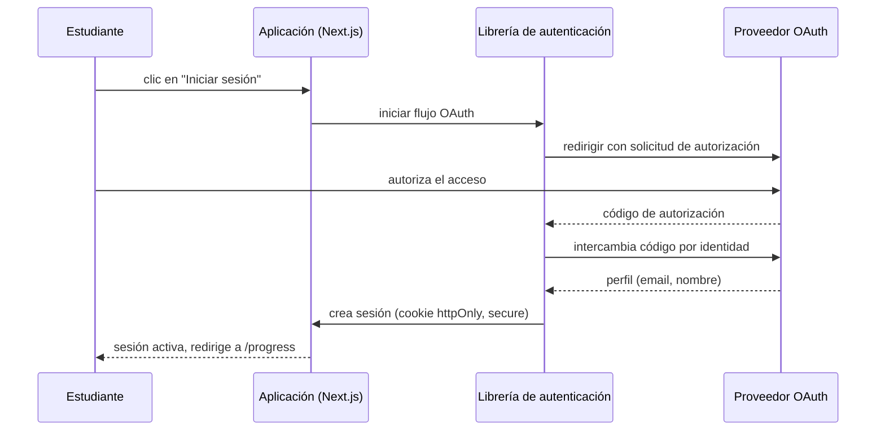

# SECURITY.md — Seguridad del Sistema

**Estado:** Aprobado

**Fecha:** 2026-07-19

Consolida los principios de seguridad ya establecidos en `CLAUDE.md` ("priorizar seguridad desde el inicio") y `docs/adr/0001-arquitectura-inicial-de-la-plataforma.md` (autenticación delegada) en un modelo de amenazas simplificado y controles concretos para el MVP.

## Modelo de amenazas simplificado

Activos a proteger: identidad del estudiante, datos de progreso/evidencia, disponibilidad de la plataforma.

| Amenaza | Vector | Control principal |
|---|---|---|
| Robo de credenciales | Formulario de login propio con contraseñas | **Eliminado por diseño**: no existe manejo propio de contraseñas (`ADR-0001`); autenticación delegada a proveedor OAuth |
| Secuestro de sesión | Cookies de sesión mal configuradas | Cookies `httpOnly`, `secure`, `SameSite` gestionadas por la librería de autenticación (`TECH_STACK.md`) |
| Inyección de datos maliciosos | Entrada de usuario no validada en la API | Validación de esquema en el borde de cada endpoint (`BACKEND.md`, `API.md`) |
| Acceso a datos de otro estudiante | Falta de autorización fina (ej. leer el `Enrollment` de otro usuario) | Toda consulta de `Enrollment`/`Evidence` filtra explícitamente por `studentId` de la sesión actual, en la capa de servicios (`BACKEND.md`) |
| Fuga de secretos (claves de API, credenciales de base de datos) | Commit accidental en el repositorio | Secretos gestionados como variables de entorno en la plataforma de hosting, nunca en el repositorio; `.gitignore` ya excluye `.env*` |
| Dependencias con vulnerabilidades conocidas | Librerías desactualizadas | CI ejecuta auditoría de dependencias antes de cada merge (ver sección CI/CD) |
| Denegación de servicio básica | Tráfico abusivo sobre endpoints públicos de catálogo | Delegado a las protecciones de la plataforma de hosting gestionada en el MVP (`BACKEND.md`); sin control propio adicional por falta de necesidad demostrada |

## Autenticación y sesiones

**Decisiones clave:**

- No se almacenan contraseñas en ningún momento — el proveedor OAuth es la única fuente de verdad de identidad.
- La sesión se representa como una cookie firmada, gestionada por la librería de autenticación; ningún endpoint de la API implementa su propio manejo de tokens.
- El `Student.id` interno (`DATABASE.md`) es distinto del identificador del proveedor OAuth (`oauth_subject`), para no acoplar el modelo de datos a un proveedor específico.

## Autorización

- **MVP: un único rol** — "estudiante autenticado". No existe rol de administrador con interfaz propia en el MVP (`ARCHITECTURE.md`); el catálogo de niveles/proyectos se gestiona fuera de la UI.
- **Regla de autorización fina:** un estudiante solo puede leer o modificar sus propios `Enrollment` y `Evidence` (`DATABASE.md`). Esta regla se aplica en la capa de servicios (`BACKEND.md`), no confiando únicamente en que el cliente envíe el `studentId` correcto.

## Validación de entrada

Todo endpoint de `API.md` que recibe datos de cliente valida forma y tipos antes de ejecutar lógica de negocio, usando la librería de validación decidida en `TECH_STACK.md`. Ninguna consulta a base de datos se construye concatenando datos de entrada directamente — el ORM elegido (`TECH_STACK.md`) parametriza las consultas por diseño, mitigando inyección SQL.

## Gestión de secretos

- Credenciales de base de datos, claves de la librería de autenticación y del proveedor OAuth: variables de entorno gestionadas por la plataforma de hosting, nunca commiteadas.
- `.gitignore` ya excluye `.env` y `.env.local` (ver configuración de repositorio existente).
- Ningún secreto se expone al cliente (navegador); las variables accesibles en el cliente se limitan explícitamente a las no sensibles (convención estándar de Next.js de prefijo público).

## Observabilidad de seguridad

Continuación directa de `BACKLOG.md` TASK-05.3.1 (logging y métricas mínimas):

- Se registran: intentos de autenticación (éxito/fallo), errores `401`/`403` de la API, errores `500` no anticipados.
- No se registran: contraseñas (no existen), tokens de sesión completos, datos personales más allá de lo estrictamente necesario para depurar un incidente.
- Las alertas básicas de disponibilidad (TASK-05.3.1) se apoyan en las capacidades nativas de la plataforma de hosting gestionada.

## CI/CD y seguridad

- El pipeline de CI (`.github/workflows/ci.yml`) se extiende, cuando exista código, con un job de auditoría de dependencias (vulnerabilidades conocidas) antes de permitir merge — mismo mecanismo de "PR + CI en verde obligatorio" ya vigente para documentación (`CLAUDE.md`).
- El despliegue a producción ocurre únicamente desde `main`, protegida (ya configurado en el repositorio), reduciendo el riesgo de despliegues no revisados.

## Explícitamente fuera de alcance de este documento

- Auditoría de seguridad externa o pentesting formal — desproporcionado para el tamaño del MVP; se reevaluaría antes de manejar datos sensibles adicionales.
- Cifrado de base de datos a nivel de aplicación (más allá del cifrado en tránsito/reposo que provee el proveedor gestionado) — no hay dato clasificado como sensible en el modelo de `DATABASE.md` que lo justifique hoy.
- Multi-factor authentication (MFA) propio — delegado implícitamente al proveedor OAuth elegido, que puede ofrecerlo por su cuenta.

## Trazabilidad

- Decisión de base: `docs/adr/0001-arquitectura-inicial-de-la-plataforma.md`.
- Backend: `BACKEND.md`. Stack: `TECH_STACK.md`. Modelo de datos: `DATABASE.md`.
- Backlog: `BACKLOG.md`, FEAT-05.1 (US-08), FEAT-05.3 (US-10).
